# 1. 【排版】

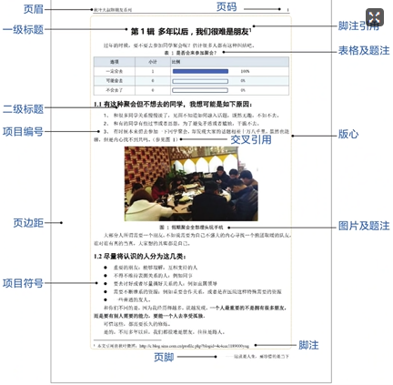

## 1.1. 【文本处理】

1. **选中文本**
    * **选中连续文本**：`单击 -- Shift -- 单击`
    * **选中不连续文本**： `Ctrl 加选`
    * **竖向选择文本**：`Alt + 拖曳`
    * **快速选中整句/整行/整段**
        > * 按住 Ctrl 键，然后在待选中的句子之间任意位置单击一下，就可以选中整句话了
        > * 光标移至页面最左侧，当光标变为指向右后，在对应行的位置单击就可以选中本行了，如果把单击改为双击，则整个段落都被选中了

2.  **文字设置**
    1. **在⼀⾏中显⽰两⾏⽂字**：`选中 → 开始 → 段落 → 中⽂版式 (双⾏合⼀)`
    2. **纵横混排**：`中⽂版式 ( 纵横混排 ) ，相当于逆时针旋转 90 度`
    3. **添加拼⾳**
        > :one: 选中 -- { 开始 -- 拼⾳指南 }
        > :two: 让拼⾳在⽂字右边⽤括号括起显⽰： 复制 -- 选择性粘贴 (⽆格式⽂本)

3. **段落设置框**
    1. **给某段落前后缩进**：`缩进：文本之前/文本之后`
    1. **首行缩进**：`缩进：首行缩进 2 字符`
    1. **段间距**：`间距：段前/段后`
    1. **行距**：`设置 固定值 = 字体大小的磅值时，刚好行间距为0`
    1. **段落文本右侧参差不齐**：`对齐方式设为 “两端对齐”`
    1. **设置西文长单词换行**：`中文版式 → 允许西文在单词中间换行`
    1. **设置某章节段落标题永远在新的一页显示**：`换行和分页 → 段前分页 / 缩进和间距 → 段后`
    1. **不让标点符号在行首**：`中文版式 → 按中文习惯控制首尾字符 & 允许标点溢出边界`
    1. **避免标题排在某页的末尾**：`换行和分页 → 与下段同页 & 段中不分页`
    1. **消除孤⾏**：`（孤⾏即⼀个页⾯只有⼀⾏内容）：换⾏和分页 → 孤⾏控制`

4. **画线**
    1. **双直线**：三个 `=` 回车
    1. **波浪线**：三个 `~` 回车
    1. **虚线**：三个 `*` 回车
    1. **隔⾏线**：三个 `#` 回车
    1. **细直线**：三个 `-` 回车
    1. **粗直线**：三个 `_` 回车

5. **去除标题前⾯的⼩⿊点**：`隐藏 “段落标记” 即可`

6. **随机⽣成⽂本**

    ```
    =rand()
    =rand(a,b) 随机插⼊ a 段⽂字，每段⽂字 b 句话
    =lorem() 随机生成英文文本
    ```

7. **快速输入重叠词组**
    * 将光标移到 “辛苦” 中间，按 Ctrl + Y 即可得到辛辛苦苦

8. **巧用自动图文集快速输入常用语句**
    * 在 Word 2013 的功能区中默认没有自动图文集功能，我们需要将其添加到快速访问工具栏
    * 『文件』选项卡 --『选项』  
        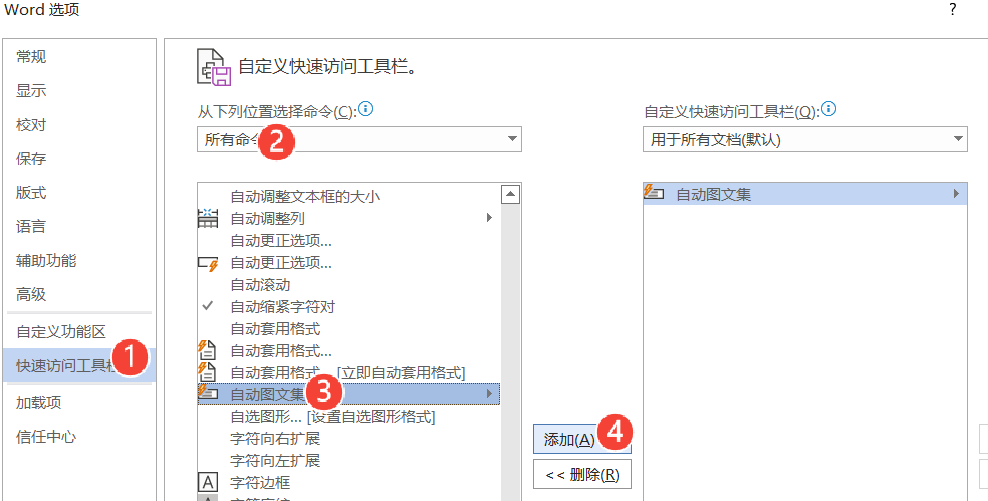
    * 选中要设为自动图文集的文本内容
    * 单击 自动图文集 按钮，在弹出的下拉列表中选择将所选内容保存到自动图文集库命令

## 1.2. 【标尺与制表位】


1.  **更精确地控制对齐刻度，可以在段落格式里找到对应的设置方法**  
    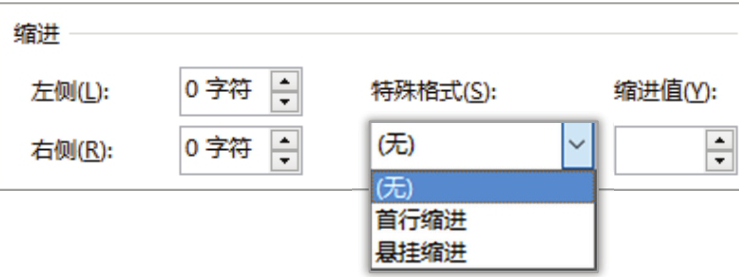
2.  **判断居中对齐的图片是否真的居中**
    * 当图片已设置居中对齐时，在文档中插入图片后，由于继承了段落默认“首行缩进2字符”的格式，导致图片并未真正居中对齐
    * 观察标尺处，发现“首行缩进”滑块拖动了一定值，导致图片和题注并没有真正居中
    * 显示了标尺，可以快速发现并纠正这一问题

3.  **表格数据始终无法居中对齐**
    *  在从别处复制过来的表格常常出现表格框内的数字始终无法居中的情况，将鼠标放进单元格再观察标尺就可以发现，文字也发生了缩进。发现问题后，拖动标尺，就可以恢复正常

4.  **制表位对齐**  
    

    * 首行缩进 和 悬挂缩进 常单独使用，此处不列出
    * 在 “⽔平标尺上” 单击可制作制表位标记，通过 tab 键可对齐⽂本； 双击标记可弹出对话框，按住标记并向下拖动可删除制表位标记  
        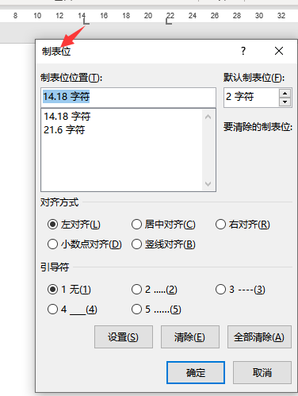
            
    * 或者 打开**段落**设置对话框，单击左下角**制表位**按钮即可进入制表位设置界面
    * 制表位的**前导符**指的是插入制表位后文本前显示的内容  
        
        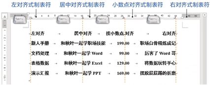

        * 目录对齐的原理即 制表位 + 前导符
    * 制表符比表格厉害的是，它并不是真的表格，是属于段落的属性，因此它是对整个段落起作用的
    * 同时有以下这些特性：
        > * 在未选择段落时设置制表位，它将对光标所在的那一整段起作用
        > * 如果要多个段落有同样的制表位设置，请在设置制表位前选中多个段落
        > * 在设置过制表位的段落中按回车，新段落会继承上一段落的制表位设置
        > * 可以用格式刷复制制表位的属性，在其他段落应用
        > * 可以添加到样式，然后一键套用

5.  **案例**
    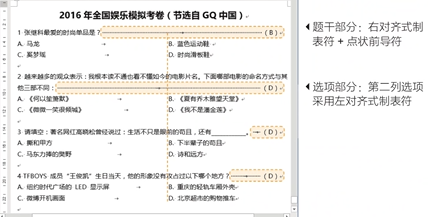

    * 在选择题排版过程中需要为题干部分添加统一的右对齐的括号
    * 题干部分则需要对齐各个选项
    * 存为样式后，还可以重复利用

## 1.3. 【图片排版】

### 1.3.1. 【图片布局方式】

1.  **嵌入型**
    * 图片相当于一个字符。嵌入型图片会受制于行间距或文档网格设置：因为 Word 把它当一个字
    * 如果发现插入图片之后只显示了一条边，快去检查行间距设置。图片被太窄的行间距挡住了

2.  **四周型、紧密型、穿越型**
    * **四周型**：文字与图片的距离更远；并且，文字总是留下一个矩形的区域
    * **紧密型、穿越型**：文字距离图片更近

3.  **衬于文字下方**：图片相当于背景图片，当文字或文本框带有底纹时，图片也会被遮挡
4.  **浮于文字上方**：图片会覆盖文字

### 1.3.2. 【图片插入方式】

> * **方式1**. 复制图片 → 粘贴
> * **方式2**. 直接将图片拖入文档
> * **方式3**. 『插入』--『图片』
> * **方式4**. 复制图片 --『开始』--『粘贴』--『选择性粘贴』-- 选择所需格式

* **方法1** 和 **方法2**
    > * 会将图片和读图软件相关信息全部贴入文档
    > * 还会自动在图片和读图软件中创建链接，如果这样操作，文档就会无意之中变得庞大

*   **方法3** 和 **方法4** :pushpin:
    > * 向 Word 插入图片时，Word会默默地自动压缩图片：默认为220ppi
    > * 当希望无损插入时，可设置：`『文件』--『选项』--『高级』--『图像大小和质量』`

### 1.3.3. 【图片的移动方式】

1.  当 **图片非常小**、**图片重叠**、**图片衬于文字下方** 时，该怎么选中图片？
    * `『开始』--『编辑』--『选择』--『选择窗格』`侧边栏 -> 直接选择

2.  **单张图片如何自由移动**
    > * **方式1**. 把布局选项设置为除嵌入式之外的形式，鼠标拖曳时会较为灵活
    > * **方式2**. 采取 `Ctrl + 方向键` 的形式，微调图片位置
    > * **方式3**. 改变文档网格线间距

    * 鼠标拖动图片移动时，每次移动的距离和文档的网格线间距一致
    * 将网格线设置到最小时，拖移时就会感觉流畅了
    * 设置网格线：`『布局』--『排列』--『对齐』--『网格设置』--『网格线和参考线』--『网格设置』`，把其中的水平间距和垂直间距都改为最小数值 0.1 →【确定】

3.  **多张图片如何自由移动**

    * **方式1**. 利用图文场功能
        :::alert-info
        * 图文场能够存储被移动的多个对象，属于“自动图文集”
        * 具体操作方法：将需要移动的图片的布局更改为文字环绕，同时选中图片 → `Ctrl + F3`，所有被选中图片移动至图文场中 → 将光标挪动至目的位置，单击 `『插入』--『文本』--『文档部件』--『自动图文集』` → 选择起初被加入的图片 → 图片插入完成
        * 被添加到图文场中的内容是作为一个整体插入新的位置或文档。所有对象都被保留在图文场中，可重复插入
        * 如果要将另一组对象添至图文场，则必须先将原内容删除
        * 如果图片1的布局为嵌入型，图片2的布局为文字环绕，则两张图片无法被同时选中
        :::

    *   **方式2**. 利用 Word 自带的剪贴板
        :::alert-info
        * 选中需要被移动的图片 → `Ctrl + C / X` 复制或剪切对象 → 重复操作，直至完成所有对象的剪切或复制 → 将鼠标移动至目标处 → `『开始』--『剪贴板』`右下角的小箭头 -- 『剪贴板』侧边栏 --『全部粘贴』，完成移动
        * 若同时选中图片（当然都是非嵌入式），也可以一次性剪切或复制，使用时也会作为整体粘贴
        :::

### 1.3.4. 【智能的对齐参考线】

* **开启/关闭**：`『布局』--『排列』--『对齐』`
* 当图片被移动到某个段落中或页面边缘时，页面中会出现智能绿色参考线

    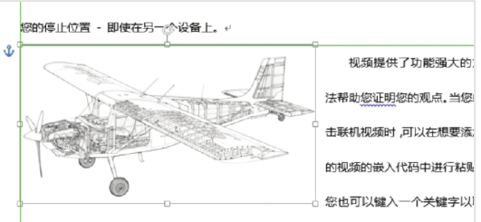

### 1.3.5. 【用锚固定图片】

* 如果不想移动图片，是可以把图片固定下来的
* **将图片固定在某一页**
    > * 在图片移动过程中，会发现有一个锚形的图案出现在图片的左边：这个符号就是“对象位置”  
    > 
    > * 当非嵌入型的图片被设置为文字环绕布局时，对象位置符就会出现
    > * 图片总是和锚所在的段落一起。在页面内移动锚，图片不会随之移动。但若是锚被移动到了不同页，那么图片会立刻挪移至新的页面中。这就是为什么有时明明没有移动图片，图片却跑到了下一页

* **将锚和图捆绑起来**：右击图片 → `『大小和位置』--『布局』--『位置』`
    > * **勾选 “锁定标记”**：会发现 “锚”被加了小锁。尝试挪动锚，会发现锚无法被选中。这时，图片可以在页面内移动，但是无法挪移到下一页
    > * **取消勾选 “对象随文字移动”**：图片位置不会因文字变化而改变。这样，图片就被固定在当前位置了
    > * 当然，也可设置图片为嵌入式，图片就不会随文字移动而移动了
 
### 1.3.6. 【图片化妆术】

> `『图片工具』--- 『格式』` 扩展选项卡

1. **统一尺寸、裁切图片**
2. **给图片去除背景**
    * **方式1**. 如果背景为纯色，`『调整』--『颜色』--『设置透明色』`
        > * 鼠标箭头变身魔棒 → 单击背景任意位置 → 去除背景色
        > * 去除的并不彻底，最适合底色是白色、文档底色也是白色的情况
        > * 如果放在深色背景的文档中，就会显示很多“背景残渣”

    * **方式2**. 『删除背景』 按钮
        > * 会生成新的标签页，内含删除背景的各种选项
        > * 被删除的区域会显示为紫红色

3. **给图片更换整体色彩**
4. **给图片增加艺术效果**
5. **给图片增加边框、阴影或三维模式**
6. **变更图片版式**
    > * 一键将 图片 转为 SmartArt
    > * 图片边自动生成文本框，以便相关文字说明的编辑

7.  **更改图片透明图、旋转等**

## 1.4. 【表格】

### 1.4.1. 【单元格斜线】

1.  **当只有⼀条斜线时**
    * 通过 『边框与底纹』 弹出框设置
    * 通过回车键输⼊两段⽂字，前者右对齐，后者左对齐

2.  **当有两条斜线时**
    * 通过 `『插⼊』--『插图』--『形状』`（直线） 的形式绘制（`格式` 选项卡中修改轮廓颜⾊ ）
    * ⽂字则通过 `『插⼊』--『⽂本框』`（绘制⽂本框） 形式输⼊（`格式` 选项卡中取消轮廓及填充⾊），最后移动、旋转⾄⽬标位置处

### 1.4.2. 【行列操作】

1.  **移动⾏和列**
    * ⾏和列可在选中后，按住不放拖动⾄⽬标处释放
    * `Alt + Shift + 上下⽅向键`：仅适⽤于移动⾏

2.  **复制⾏和列**：`Ctrl + 拖动⾏/列`

3.  **快速插入行/列**
    * 将光标移至需要插入的地方：鼠标悬停时，会出现蓝色十字符号
    * 单击蓝色加号，在加号位置完成添加行或列

4.  **⾏⾼列宽**
    :::alert-info
    1. **⼿动调整**
        * 直接拖动
        * ⾃动调整（双击边框线：仅能调整列宽）
        * Alt + 左键拖动（精细调整）
        * 左右键同时按下（精细调整）

    2.  **精确调整**
        * 『表格⼯具』 -- 『布局』 选项卡中输⼊宽⾼度

    3.  **平均分布⾏列**
        * 『表格⼯具』 -- 『布局』 选项卡 -- 『单元格⼤⼩』组 -- 『分布⾏/列』
    :::

### 1.4.3. 【表格样式】

1. **拆分表格**：选中相关⾏或列，拖动⾄⽬标处
2. **表格样式**：`『设计』`选项卡 -- 表格样式
    > 1. **使⽤预定义表格样式**：默认：应⽤并清除格式；右击可选择更多功能
    > 2. **⾃定义表格样式**：右击选择：新建表格样式，例如可以实现隔⾏换⾊的功能

3. **一键统一表格样式**

    * step1. 新建表格样式，假设这个样式被命名为“常用样式”
    * step2. `『视图』--『宏』--『查看宏』`
        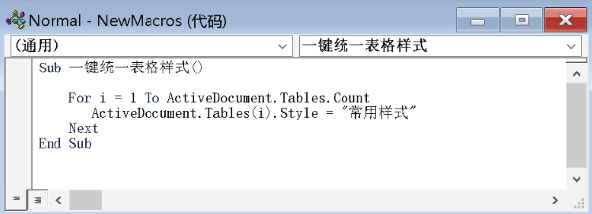

        * 在宏名称中输入 “一键统一表格样式” ->【创建】，弹出VBA编程窗口
        * 将程序语句填入 Sub 和 End Sub 之间即可 `For i = 1 To ActiveDocument.Tables.Count ActiveDocument.Tables(i).Style = "常用样式" Next`

    * step3. `『视图』--『宏』--『查看宏』` 出现了刚才新建的VBA程序 ->【运行】
        * 文档内所有的表格都应用 “常用样式” 成功！

### 1.4.4. 【表格属性】

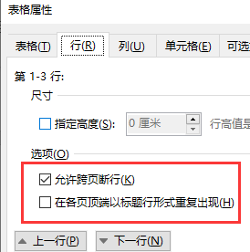

* **跨页断⾏**：勾选 “允许跨页断⾏”
* **重复标题⾏**：选中标题⾏，再勾选 “在各页顶端以标题⾏形式重复出现”
    * 如果表格的文字环绕类型为『环绕』，则重复标题行的效果不显示，可以在『表格属性』中将文字环绕类型改为『无』

### 1.4.5. 【绘图】

* 『表格⼯具 -- 布局』选项卡 --『绘图』--『橡⽪擦』：单击边框或框选；可实现合并单元格效果
* 『表格⼯具 -- 布局』选项卡 --『绘图』--『绘制表格』：可实现拆分单元格效果

### 1.4.6. 【表格自动计算】

* 定位单元格 -> 『表格扩展选项卡：布局』--『数据 - 公式』--『查看公式』  
    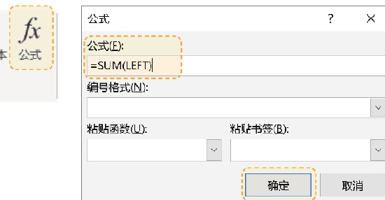

    > * Word 和 Excel 的单元格命名方法相同：第一行第一列是A1，第二列第一行是B1，以此类推
    > * 更改公式：删除『公式』中 “=” 后面的部分 → 单击『粘贴函数』右侧的向下箭头进行选择
    > * 设置数据的显示格式：『编号格式』右侧的向下箭头进行选择
    > * Word 的内置函数有一个缺点：无法自动刷新
    > * 手动更新：右键 →『更新域』或 F9
    > * 公式不仅在表格中可以使用，在页眉页脚、正文及文本框内也可以使用

### 1.4.7. 【无法删除最后一页】

* **方式1**. 减少行间距
    * 『段落』对话框 → “行距” 选择 “固定值”，设定值为 “1磅”

* **方式2**. 减少页边距
    * 『布局』--『页面设置 - 页边距』-- 单击 “窄” 方案 或 自定义边距

### 1.4.8. 【⽂本与表格转换】

1. **⽂本转换表格**：插⼊ -- 表格 -- 表格（下拉列表：⽂本转换成表格）
2. **表格转换⽂本**：『布局』选项卡 -- 数据 -- 转换为⽂本

### 1.4.9. 【快速输⼊序号】

* **列数据**
    * 定位单元格：插⼊ -- ⽂档部件（下拉列表：域）
        > * **类别**：编号
        > * **域名**：AutoNum
        > * **格式**：1，2，3...

    * 复制序号，选中同列的其他单元格进⾏粘贴

### 1.4.10. 【排序】

> 『布局』选项卡 -- 数据 -- 排序

### 1.4.11. 【在 Word 中引⽤ Excel 表格】

1. Excel 中复制内容 -- Word 中选择性粘贴（粘贴链接：带格式⽂本 RTF）
2. 当 Excel 中数据改变时，在 Word 中右击选择 “更新链接” 可更新数据

## 1.5. 【图表】

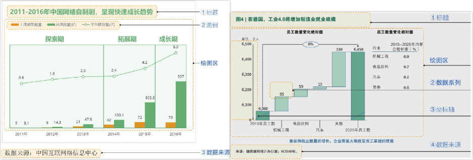

1.  **插入图表**
    

    * 在 Excel 复制图表 -- 『粘贴』下方箭头 --`『链接与保留原格式』`/`『链接与使用目标格式』`二选一
    * 完成之后，只要原图表发生任何变化，在文档中选择更新即可：右击图表 --`『更新链接』`

2.  **数据图表**：`『插入』--『插图』--『图表』`

3.  **非数据图表**
    * 有时需要制作非数据类图表，如流程图、组织结构图等。此时，可用 SmartArt 的现成方案
    * `『插入』--『插图』--『SmartArt』`
        * 以插⼊层级关系图为例
        * “设计” 扩展选项卡 -- ⽂本窗格
            > * 可为图形设置⽂字
            > * 通过 Enter 键输⼊⽂字以⾃动插⼊图形
            > * 右击选择升级、降级、上移、下移

## 1.6. 【公式录入与编排】

* **方式1**. 键盘录入并配合上下标法
* **方式2**. Word 内置公式插入法
    :::alert-info
    * `『插入』→『公式』→『插入新公式』` 或 `Alt + =`
    * 如果『公式』按钮为灰色，是因为文档版本较早处于兼容模式，需要单击 『文件』--『信息』--『转换』 为高级版本，以使用新的增强编辑器
    * 字体默认为 Cambria Math，只能将公式改为普通文本时才能修改字体，此时牺牲掉的又是公式原有的格式
    :::

* **方式3**. 第三方数学公式编辑器 MathType 法

## 1.7. 【绘图】

1. **Ctrl**：`以中⼼点向四周绘制` / `复制`
2. **Shift**：`等⽐例绘制` / `以 45 度⾓递增绘制`
3. **连续使⽤绘图⼯具**：`插⼊ -- 形状 -- 某个绘图⼯具`（右击：锁定绘图模式）
4. **选择**
    > * **加选**：Ctrl
    > * **框选**：开始 -- 选择（选择对象）

5. **复制**
    > *  `Ctrl + 拖动`
    > *  `Ctrl + D`
    > *  `F4`（重复上⼀次操作）

6. **格式选项卡**
    > * **对齐⽅式**
    > * **选择窗格**：对图形重命名、显⽰隐藏、排序
    > * **宽⾼度设置**
    > * **层次叠放次序**
    > * **组合与取消组合**
    > * **旋转**
    > * **更改形状**：插⼊形状 -- 编辑形状（更改形状）

7. **线条编辑**：右击选择：编辑顶点
    > * 单击顶点后两端出现控制点，可根据控制点调节线条
    > * 右击可改变顶点调节⽅式，也可删除、断开、合并顶点
    > * Ctrl + 单击可添加删除节点

8. **⽂本框**
    1. **插⼊⽂本框**
        > * **⽅式1**. 插⼊ -- 形状 -- 基本形状（⽂本框、垂直⽂本框）
        > * **方式2**. 插⼊ -- ⽂本框（绘制⽂本框、绘制竖排⽂本框）

    2. **设置形状格式**：选中后右击 -- 设置形状格式 -- 布局属性
        > * **⽂字版式**：设置垂直对齐⽅式、⽂字⽅向、是否在旋转图形时同时旋转⽂字
        > * **根据⽂字调整形状⼤⼩**
        > * **内部边距**

    3. **创建链接**
        > * **作⽤**：让多余的⽂字在其他图形上显⽰
        > * **步骤**：选中 → 『"格式" 扩展选项卡 -- 创建链接』→ 单击⽬标⽂本框（如果是形状，需先右击添加⽂字 或 选中直接输⼊⽂字 以激活⽂本框功能 ）

## 1.8. 【⾼级排版】

* step1. 页⾯设置，确定纸张⼤⼩、纸张⽅向、页边距
* step2. 布局 -- 分栏
    > 选中段落，则只对选中的段落进⾏分栏，否则，对整篇⽂档进⾏分栏

* step3. 借助 `{插⼊ -- ⽂本框 }` 进⾏布局
    > 通过右击设置⽂本框的形状格式（⽆填充、⽆线条）

# 2. 【样式】

1. **新建样式**
    > * **⽅式1**. 样式窗⼝：`Ctrl + Shift + Alt + S`，单击 “新建样式” 按钮
    > * **方式2**. 选中 -- `『开始』--『样式』--『创建样式』`

2. **应⽤样式**：`Ctrl + Shift + S` 或 `使⽤所设置的快捷键`

3. **清除格式**：`Ctrl + Shift + N`

4. **利⽤模板共享样式**
    * 新建的⽂档都是基于模板创建的，所以新创建的⽂档⾃带了模板的所有样式 以及 其他设置项（页眉页脚、页边距等等）
    * 默认情况下，新建的样式仅限于当前⽂档；若也想运⽤于其它新建⽂档，则需要借助模板
        > * **⽅式1**. 在对应样式上右击选择修改，勾选 “基于该模板的新⽂档”  
        > * **⽅式2**. 『样式窗⼝』--『管理样式』--『导⼊/导出』 => 将需要的样式复制到模板

5. **查看模板⽂件**：`⽂件 -- 选项 -- 加载项 -- Word加载项`，单击 `“转到” -- 模板`，单击 `“选⽤” (Normal.dotm)`

6. **修改模板⽂件**：打开 Normal.dotm ⽂件修改

7. **自动更新设置**  
    
    
    
    

    > * 标题类样式建议勾选自动更新 --- 只需更改任意某个标题，其他标题自动变化更新
    > * 正文不建议勾选 --- 正文各段落内格式可能会有“局部的改动”，不希望应用于全文
    > * 如果无法确定的话，建议全都不勾选，需要修改格式时，可直接在样式内修改，也能实时更新

8. **样式类型**  
    
    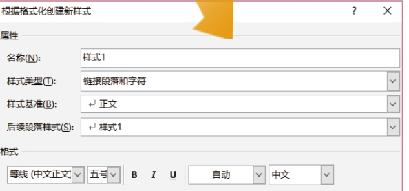

    > 样式类型一般分为 字符、段落 及 链接段落和字符，其中，链接段落和字符样式在选中文字时，仅对文字起作用，否则对整个段落起作用，所以一般选择链接段落和字符即可

# 3. 【列表符号与多级列表】

## 3.1. 【列表符号】

* **回车**：`继续列表显⽰`
* **两次回车**：`取消列表显⽰`
* **继续/重新编号**：`右击选择：继续编号、重新开始编号`
* **调整列表符号与内容之前的距离**：`右击 -- 调整列表缩进 -- 编号之后`
* **改变列表级别**：`Tab` 、 `Shift + Tab`

## 3.2. 【让标题⾃动产⽣编号】

* 开始 → 多级列表 → 定义新的多级列表（单击 “更多” 按钮）

    * 选中 “级别1”
        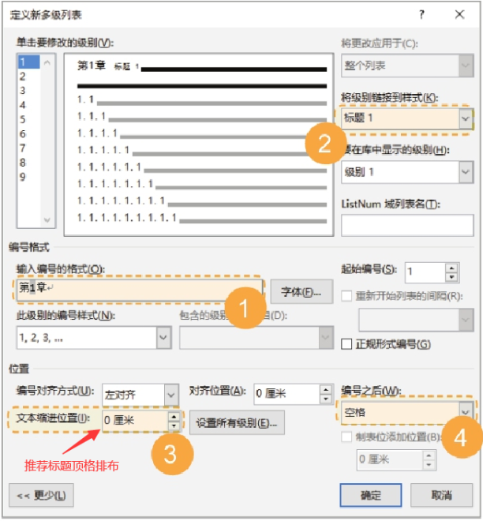

        > * 【编号格式框】第1章（保持⾃⾝的1不变，前⾯加第，后⾯加章）
        > * 【要在库中显⽰的级别】级别1
        > * 【将级别链接到的样式】标题1

    * 选中 “级别2”  
        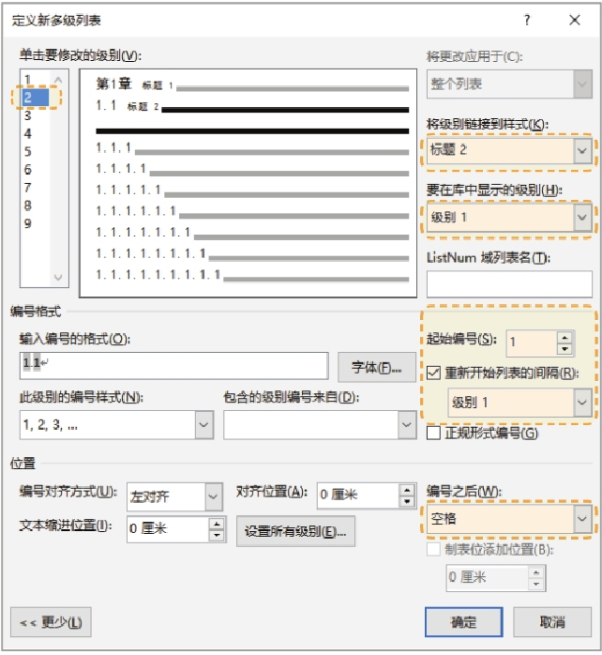

    * 选中 “级别3”  
        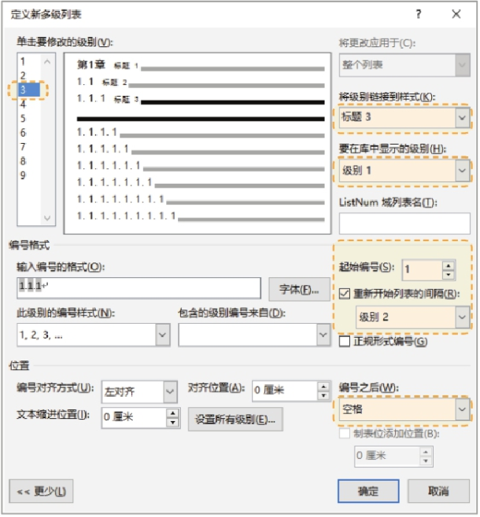

> 可以直接在 **导航窗格** 中拖动文本，鼠标按住第3章内容并拖动到2章前面，相应章节的内容即可交换位置，由于设置了多级列表，文档中的章节编号能够自动更新

# 4. 【题注】

* 为了编排文档中的图片与表格等，通常在图片下方、表格上方添加一段文字说明，这行文字称之为题注
* 也即，题注就是给图片、表格、公式等项目添加自动编号和名称


1. **插⼊题注**：图⽚居中 -- 右击选择 `“插⼊题注”`
    > * 【新建标签】图
    > * 【位置】所选项⽬下⽅
    > * 【编号】
    > * 【格式】 1 ， 2 ， 3 ...
    > * 【包含章节号】起始样式：标题 1 ；分隔符：连字符

2. **自动添加题注**  
    
    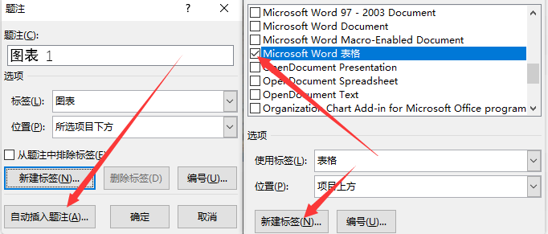

    * 尽管可选的类型很多，但最常用的是勾选 “Microsoft Word 表格”
    * 设置完自动插入题注后，只有此后插入的文档才会自动添加题注。此前已经存在的文档，即使符合文件类型要求，也不会自动生成题注

3.  **交叉引用**
    
    * 当插入或删除图片，导致交叉引用不更新时，直接 `Ctrl + A` ，按 `F9`，更新域
    * 常见的引用对象包括标题、脚注、书签、题注、编号段落等
    * 题注 和 交叉引用 常常配合使用
    * 『引用』-- 『题注』-- 『交叉引用』  
        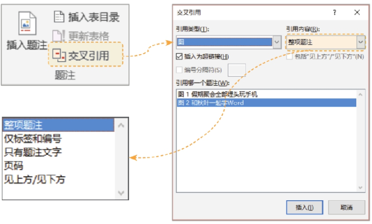
        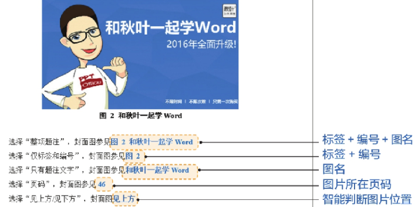

# 5. 【查找与替换】

1. **使⽤通配符**
    * `*` 代表任意多个字符
    * `?` 代表任意单个字符

2. **使⽤特殊格式**
    * `^p` 表⽰段落标记
    * `^l` 表⽰换⾏
    * `^13{2,}` `^13` 表⽰硬回车，即 `^p`，⽀持更多正则表达式语法
    * `^11` 表⽰软回车，即 `^l`
    * `^32` 表⽰半⾓状态下的空格
    * `^u8195` 表⽰全⾓状态下的空格
 
***

1. **批量更换字体颜色**
    > * 查找：「格式」-「字体」，「字形」=> 加粗
    > * 替换为：「格式」-「字体」，「字体颜色」=> 红色

2. **批量给指定内容添加括号**
    > * 选中需要添加括号的内容 -- `Ctrl + H` -- 替换为：输入括号，然后定位到括号中间
    > * 点击「特殊格式」-「查找内容」

3. **批量删除所有图片**
    > * 查找：「特殊格式」-「图形」
    > * 替换为：留空即可

4. **清除全文空行**
    > * 查找：`^p^p`
    > * 替换：`^p` 重复单击几次【全部替换】按钮，直至全部替换

5. **清除无用空格**
    > * 查找：`^w`
    > * 替换：留空即可

# 6. 【页眉页脚】

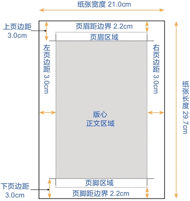

1. **在页眉页脚的区域双击**
    > * 页眉页脚只有⼀⾏，默认只能在中间输⼊内容
    > * 若想在多个区域输⼊内容，可执⾏ `设计 -- 页眉/页脚 -- 空⽩（三栏）` 按 `Delete` 可删除其中某个栏⽬
    > * 插⼊页码：编辑页脚，执⾏ `设计 -- 页码 -- 页⾯底端`

2. **设置不从 1 开始的页码**
    > * 假设文档存在这样的结构：封面 → 前言 → 目录 → 正文 → 附录
    > * 其中封面不需要显示页码，但是和前言的页码连续计算。即封面不显示页码，前言的页码从2开始
    > * 只需在页脚位置插入页码后，在『页眉页脚』中勾选 `『首页不同』` 就可以了

# 7. 【分页符和分节符】

```
第⼀章 基础 
1.1 变量与常量 
    1.1.1 变量 
1.2 数据类型
1.3 运算符
... 
第⼆章 ⾯向对象
...
第三章 异常 ...
```

1. **插⼊分页符**
    > * **⽬的**：保证每⼀章都位于⼀页的开始
    > * **使⽤**：在上⼀章的末尾按 `Ctrl + Enter`
    > * **问题**：设置页眉时，每⼀页的页眉相同

2. **插⼊分节符**
    * **⽬的**
        > * 位于同⼀节的页⾯其页眉页脚等设置项相同，不同节的页⾯可设置不同的页⾯布局
        > * 不仅可保证每⼀章都位于⼀页的开始，还可以为每⼀章设置不同的页眉页脚、页边距等

    * **使⽤**：`『布局』--『分隔符』--『分节符』--『下⼀页』`
        > * 『导航窗⼝中单击 “第⼀章 基础”』设置页眉为 “第⼀章 基础”
        > * 『导航窗⼝中单击 “第⼆章 ⾯向对象”』双击页眉处，先执⾏ “设计”选项卡 -- 取消选中 “链接到前⼀条页眉”，然后设置页眉为 "第⼆章 ⾯向对象"
        > * 『...』

    * 可在『草稿』视图中删除相关分节符
    * 更简单的⽅式：插⼊ -- ⽂档部件 -- 域（域名：StyleRef；域属性样式名：标题1）

3. **奇偶页不同**
    > 任选某个偶数（或奇数）页，双击『页眉』区域，勾选 『设计』选项卡 -- 奇偶页不同，输⼊页眉内容，则所有的偶数页都和刚才输⼊的内容⼀样

# 8. 【⽬录】

* `引⽤ -- ⽬录 -- ⾃动⽬录`：根据导航窗格⾥的标题列表创建
* 当内容（标题名称、标题所在页码）发⽣变化时，可右击⽬录选择 **『更新域』**

# 9. 【零散知识点】

## 9.1. 【修订与批注】

1. **修订**
    1. **启⽤修订状态**：`审阅 -- 修订`
    2. **开始修改⽂档**
    3. **显⽰状态**
        > `审阅 -- 修订 -- 所有标记`：删除的内容以删除线加红⾊显⽰，新增内容以下划线加红⾊显⽰

    4. **进⾏审阅**（接受还是拒绝）
        > 选中内容 或 选中批注：`审阅 -- 更改 -- 接受/拒绝`

2. **批注**：`审阅 -- 批注组`

3. **⽐较与合并**：`审阅 -- ⽐较`（⽐较、合并、显⽰源⽂档）
    > * **⽐较**：⽐较两个⽂档的不同；当修订时没启⽤修订功能可以⽤此功能补救，配合 `审阅 -- 更改组 -- 下⼀处`
    > * **合并**：将多位修订者的结果合并到⼀起；再统⼀进⾏拒绝或接受更改（多次单击『合并』）

## 9.2. 【校对与⾃动更正】

1. **校对**：`⽂件 -- 选项 -- 校队 -- 键⼊时检查拼写`
2. **自动更正**
    > * `⽂件 -- 选项 -- 校对 -- 单击『⾃动更正选项』`（替换：PI；替换为：3.1415926）输⼊ PI，按空格或回车或... ，将⾃动变为 “3.1415926”
    > * 对于表格、图片、带格式文字等，需要先选中，再到后台选项（校对--自动更正）

## 9.3. 【加密与限制编辑】

1. **加密⽂档**：`⽂件 -- 信息 -- 保护⽂档 -- ⽤密码进⾏加密`
2. **限制编辑**：`⽂件 -- 信息 -- 保护⽂档 -- 限制编辑`
    > * step1. 格式化限制 或 编辑限制
    > * step2. 单击『是，启动强制保护』

## 9.4. 【⽔印】

1. 『设计』选项卡 -- ⽔印 -- ⾃定义⽔印
2. 激活『页眉与页脚』的前提下，可以对⽔印进⾏移动、缩放、旋转

## 9.5. 【书签与超链接】

1. **书签**
    * **插⼊书签**：选中 -- `『插⼊ -- 书签』`
    * **定位**：单击『书签』功能 -- 选中『书签名』，单击定位
        * 设置超链接，可链接书签名进⾏定位

2. **超链接**
    * **链接对象**：⽂字、图⽚、图形、⽂本框、艺术字 ...
    * **链接地址**：本地路径、⽹络路径、书签、标题、⽂档顶端、邮件 ...

## 9.6. 【标记】

* `开始 → 段落 → 显⽰/隐藏编辑标记`
* `⽂件 → 选项 → 显⽰ → 始终在屏幕上显⽰这些格式标记`
    > * **Enter**：段落（标记：竖左横箭头；`^p`）
    > * **Shift + Enter**：换⾏（标记：竖线箭头；`^l`）

## 9.7. 【对象】

1. 在 word 程序中编辑其他程序：`插⼊ -- 对象`
2. `插⼊ -- 对象（⽂件中的⽂字）`：将其它⽂件中的⽂字插⼊到光标的位置处

## 9.8. 【脚注和尾注】

1. **脚注**
    > * 位于页⾯底部，作为⽂档某处内容的注释
    > * 通常，脚注通过页面底部的短横线和正文做区分，字号也比正文略小。所有的脚注都有编号

2. **尾注**：位于⽂档末尾，列出引⽂的出处等

## 9.9. 【⾸字下沉与图⽂框】

1. **⾸字下沉**：⾸字下沉是图⽂框的化⾝
2. **图⽂框**
    * ⼀种框架，可调整其⼤⼩并置于页⾯任意位置的容器
    * 若要放置包含批注、脚注、尾注或特定域的⽂字或图形，则必须使⽤框架⽽不是⽂本框
    * 制作图⽂框的⽅式
        > * ⾸字下沉
        > * ⾃定义⼯具栏：word 选项 -- 快速访问⼯具栏：右边（不在功能区中的命令：插⼊图⽂框）

## 9.10. 【主控⽂档】

1. **含义**：将多个单独的⽂档的内容，合并到同⼀个⽂档中，形成主控⽂档

2. **步骤**
    > 1. 打开主控⽂档：`视图 -- ⼤纲视图 -- 单击『显⽰⽂档』-- 单击『插⼊』`（多次插⼊）
    > 2. 当关闭并再次打开时，⼦⽂档将以⽂档路径的⽅式显⽰，此时应单击`『展开⼦⽂档』`（⼤纲视图 -- 主控⽂档）

3. **断开『主控⽂档与⼦⽂档』的链接**：`⼤纲视图 -- 主控⽂档 -- 显⽰⽂档 -- 取消链接`

4. **拆分⽂档**
    > 1. 打开需要拆分的⽂档
    > 2. 以⼤纲视图显⽰⽂档
    > 3. 在需要拆分的地⽅的标题处，设置『级别』
    > 4. 选中要拆分出来的⽂档（含带级别的标题）。将⿏标移动到标题前的空⼼⼗字符号上，此时⿏标指针变成⼗字箭头，点击⿏标即可选定该标题以及其包括的内容
    > 5. 打开⽂档操作，点击『显⽰⽂档』，展开相应⽂档操作按钮
    > 6. 点击『创建』按钮，创建⼦⽂档
    > 7. 点击『保存』按钮，弹出『另存为』对话框，即可⽣成以『设置了级别的标题』为⽂件名的⼦⽂档

# 10. 【高级进阶】

## 10.1. 【域】

1. **新建域代码**：`Ctrl + F9`
2. **显⽰或隐藏域代码**：`ALT + F9`（所有显⽰）或 `Shift + F9`（单个显⽰）
3. **更新域**：`F9`
4. **取消域的链接**：`Ctrl + Shift + F9`
5. **域的格式**：`{ Name [参数] [\Switches ] }`
    > * **Name**：表⽰域的名称
    > * **参数**：某些域有参数，某些没有；某些域带不同的参数，作⽤就不同
    > * **\Switches**：域开关，分通⽤开关和只能⽤于某个域的特有开关两种
    > * :warning: 注意：域的名称、参数和开关之间是⼀个空⽩字符

    ```
    {Date \@ "yyyy 年 M ⽉ d ⽇"}     # 2010 年 2 ⽉ 5 ⽇ 
    第 {Page} 页                      # 第 8 页
    第 {Page \* roman} 页             # 第 vii 页
    ```

## 10.2. 【邮件合并】

* step1. 在 Excel 中准备数据源
    

    > * 数据源中，以希望嵌⼊的信息为表头
    > * 必须包含邮件地址

* step2. 新建 Word ⽂档，输⼊需要发送的邮件正⽂
    ```
    【债主姓名】你好
    请将款项【⽋债⾦额】汇⼊中国⼯商银⾏账号 12345 。结算时以⼈名币为单位。最后还款⽇为本⽉ 13 ⽇。 
    如有疑问，可随时咨询电话 800400 谢谢！
    ```

* step3. 邮件 -- 开始邮件合并 -- 邮件合并分步向导 -- 电⼦邮件
* step4. 勾选『使⽤当前⽂档』，单击『下⼀步，选择收件⼈』
* step5. 点击『浏览』，选择步骤 1 中保存的 Excel ⽂档，然后再选择具体的⼯作表
* step6. 回到⽂档页⾯，光标挪⾄需要插⼊具体内容的位置，点击『插⼊合并域』按钮，出现所有需要的字段
* step7. 点击『下⼀步: 撰写电⼦邮件』
* step8. 单击『下⼀步: 预览电⼦邮件』，点击右侧预览『收件⼈ :1』后箭头，可查看所有完成后的⽂档
* step9. 点击『下⼀步: 完成合并』
* step10. 对众多邮件中的某个进⾏差异化修改：邮件 -- 完成并合并 -- 编辑单个⽂档，再点击『关闭』按钮（取消或保存）
* step11. 邮件 -- 完成并合并 -- 发送电⼦邮件
    > * 【收件⼈】选择邮件地址
    > * 【主题⾏】输⼊⾃定义邮件主题

> 【说明】步骤3 到 步骤9（不包括步骤6）的替代⽅案：邮件 -- 选择收件⼈ -- 使⽤现有列表

***

* **批量打印桌签**
    * **标签模板**：可把当前页⾯划分成多个⼩的区域，以⽤于在同⼀页中，批量制作多个⼩的标签
    * step1. `邮件 -- 开始邮件合并 -- 标签`，单击『新建标签』
        * 标签名称
        * 上/侧边距
        * 标签宽⾼度
        * 横/纵向跨度：标签宽⾼度 + 距相邻标签的右/下边距
        * 横/竖标签数：标签的数量

    * step2. 从 Excel 复制模板 或 从 Word 制作
        
    
    * step3. 光标挪⾄需要插⼊具体内容的位置，点击『插⼊合并域』按钮，出现所有需要的字段
    * step4. 单击 `邮件 -- 更新标签` 以快速在其他区域创建标签

## 10.3. 【宏】

1. **概念**：由⼀系列 Word 指令组成，⽤于批量处理任务，提⾼⼯作效率，本质为 VBA 代码
2. **使⽤**：`视图 -- 宏`（查看宏、录制宏、暂停录制、停⽌录制）
    1. **录制宏**
        > * 宏名
        > * 将宏指定到 按钮 还是 键盘（可设置快捷键）
        > * 将宏保存在 模板 还是 当前⽂档

    2. **查看宏**：运⾏、单步执⾏、创建、删除、编辑（VBA 代码 ） 、管理器

# 11. 【技巧 & FAQ】

1. **将复制的内容转换成图⽚**：`开始 -- 粘贴 -- 选择性粘贴 -- 图⽚`

2. **根据导航窗格的⼤纲内容转成 ppt**
    > * ⽂件 -- 选项 -- 快速访问⼯具栏 -- 所有命令 选择『发送到 Microsoft PowerPoint』，单击『添加』
    > * 单击『发送到 Microsoft PowerPoint』，将以『⼤纲级别』内容⾃动⽣成 ppt

3. **删除页眉与页脚中的下划线**
    > 激活页眉与页脚，单击『边框与底纹』（边框：设置“⽆”；应⽤于“段落”）

4. **导出 word 中的图⽚**
    > 保存为 `docx` 格式 ，改后缀名为：`rar` ；解压：图⽚全在 `word/media` ⽂件夹中

5. **隐藏上下页⾯间的空⽩部分**
    > 光标移动到上下页⾯间的空⽩处，待光标变换时，双击即可

6. **解决微软雅⿊字体⾏距过⼤的问题**
    > 1. 光标定位到微软雅⿊段落内，打开段落设置对话框
    > 2. 取消勾选『如果定义了⽂档⽹格，则对齐到⽹格』

7. **插⼊的图⽚显⽰不完整**
    > 原因是⾏距设置过⼩，图⽚没有空间显⽰

8. **ppt 转 word**：`⽂件 -- 导出 -- 创建讲义`

9. **解决英⽂字符不能正确竖直排放的问题**
    > 将半⾓字符转为全⾓字符：`⽂件 -- 字体组 -- 更改⼤⼩写（全⾓）`

10. **⽂字之间间距过⼤的原因**
    > * 半全⾓问题
    > * 分散对齐问题
    > * 字体弹出框：字间距设置问题
    > * 段落弹出框 -- 中⽂版式 -- 允许西⽂在单词中间换⾏

11. **解决⽂档最后存在空⽩页的情况**
    > * **可能原因1**. ⽂档的倒数第⼆页最后存在 分页符 或 分节符
    > * **可能原因2**. ⽂档的倒数第⼆页最后存在表格的问题
    >     * 光标定位到最后⼀页开头 -- 段落弹出框 -- ⾏距（固定值：1磅）

12. **解决表格⽆法调整⾏⾼度的问题**
    > * 看是否存在段落标记，删除标记即可
    > * 打开『段落对话框』，看是否设置了⾏距、段前间距等
    > * 『布局』选项卡，看对齐⽅式，设置⽔平居中，再调整⾼度
    > * 『布局』选项卡，查看『单元格边距』

13. **给表格边框线描粗**
    > 『设计』扩展选项卡 -- 边框组（设置边框⼤⼩，此时『边框刷』选中，为指定的边框按住⿏标不  
    动绘制，结束则取消选中 “边框刷”）

14. **删除页⾯底部的尾注横线**
    > * **问题**：插⼊尾注后会有⼀条短横线，如果尾注跨页了，则跨页的页⾯会有⼀条长横线
    > * **解决**
    >     * 打开『草稿』视图
    >     * 引⽤ -- 『脚注』组（显⽰备注），此时⽂档下⽅会出现尾注编辑栏
    >         * 下拉列表中选择『尾注分隔符』，删除短横线
    >         * 下拉列表中选择『尾注延续分隔符』，删除长横线


15. **启用剪贴板无限次复制粘贴**：`「开始」-「剪贴板」`（位于格式刷右下角）

16. **快速删除段末的空格**
    > 选中要去除段末空格的所有段落，在『开始』选项卡 -- 『段落』组 -- 单击『居中』按钮，让选择的段落以居中方式对齐，此时可看到段末的所有空格全部被自动删除了，然后再单击其他对齐方式按钮使段落恢复为原本的对齐方式即可

17. **将文本框文字快速复制/移动到正文**

    > * **移动全部文字**：选中文本框，按住 `Ctrl` 不放，在文本框边框上单击鼠标右键，此时文本框中的文字将会全部移动到正文中
    > * **移动部分文字**：在文本框中选中要移动的文字，按住 `Ctrl` 不放，在文本框边框上单击鼠标右键，文本框中所选的文字将会移动到正文中
    > * **复制全部文字**：选中文本框，按住 `Ctrl + Shift` 不放，在文本框边框上单击鼠标右键，此时文本框中的文字将会全部被复制到正文中

18. **改变 Word 的默认字体格式**

    *  Word 文档默认的中文字体格式是宋体，西文字体格式是 Times New Roman  
        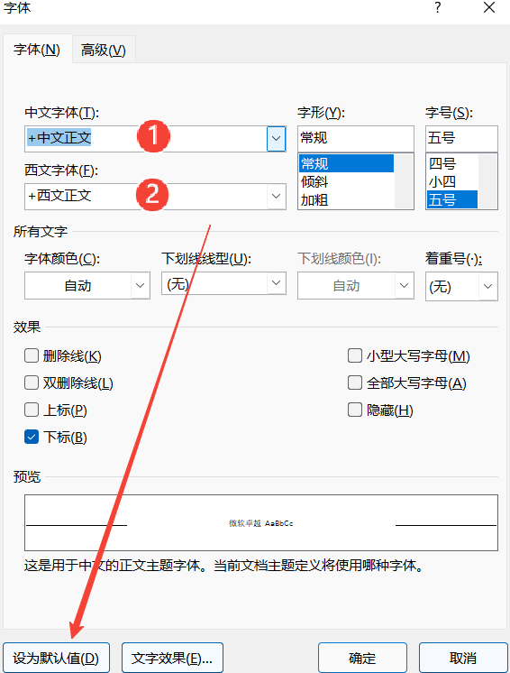

19. **在文档内隐藏或显示字符**
    > * **隐藏字符**：选中要隐藏的文本内容，在『字体』弹出设置对话框中，勾选『隐藏』复选框
    > * **显示隐藏文本**：在『Word 选项』弹出对话框中，切换到『显示』选项卡，勾选『隐藏文字』复选框

# 12. 【快捷键】

* **上标** `Ctrl + Shift + =`
* **下标** `Ctrl + =`
* **字体设置** `Ctrl + D`
* **段落居中对齐** `Ctrl + E`
* **两端对齐** `Ctrl + J`
* **重复上⼀步操作** `F4`
* **增⼤减⼩字体** `Ctrl + 中括号`
* **每次以 10 磅的步长改变字体⼤⼩** `Ctrl + Shift + 尖括号`
* **切换⼤⼩写** `Shift + F3`
* **复制格式** `Ctrl + Shift + C`
* **粘贴格式** `Ctrl + Shift + V`
* **多次使⽤格式刷** `双击格式刷`
* **插⼊⽇期** `Shift + Alt + D`
* **单倍⾏距** `Ctrl + 1`
* **双倍⾏距** `Ctrl + 2`
* **1.5倍⾏距** `Ctrl + 5`
* **版权符号** `Alt + Ctrl + C`
* **注册符号** `Alt + Ctrl + R`
* **商标符号** `Alt + Ctrl + T`
* **省略号** `Alt + Ctrl + 句号`
* **快速将文本提升为标题样式** `Alt + Shift + 左右方向键`
